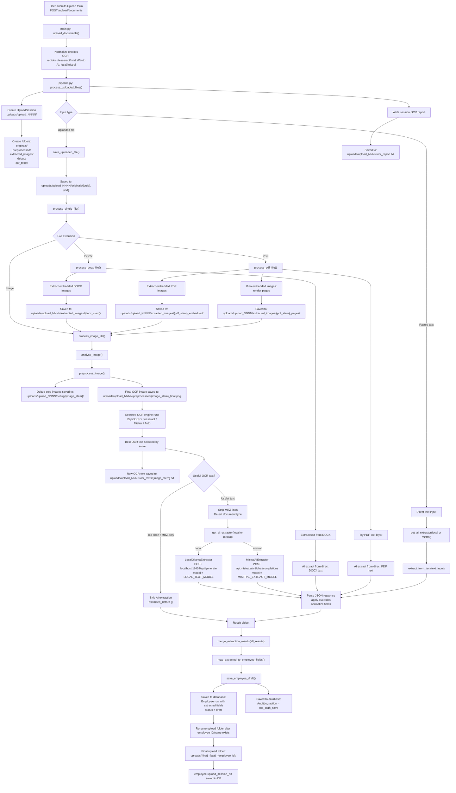

# Upload To AI Extraction Workflow

This diagram focuses only on the upload section through OCR and AI extraction, including where files and extracted data are saved.

## Save Points

- Original uploads: `uploads/upload_NNNN/originals/`
- Extracted PDF/DOCX images: `uploads/upload_NNNN/extracted_images/`
- Preprocessed OCR images: `uploads/upload_NNNN/preprocessed/`
- Debug preprocessing images: `uploads/upload_NNNN/debug/{image_stem}/`
- Raw OCR text per image: `uploads/upload_NNNN/ocr_texts/{image_stem}.txt`
- Combined OCR report: `uploads/upload_NNNN/ocr_report.txt`
- AI extracted fields: saved into the `Employee` database row through `save_employee_draft()`
- Upload folder final name: renamed to `uploads/{first}_{last}_{employee_id}/`
- Final folder path: saved in `employee.upload_session_dir`

Note: AI extractor output is not saved as a standalone JSON file. It is merged, mapped to employee fields, and saved into the database.
